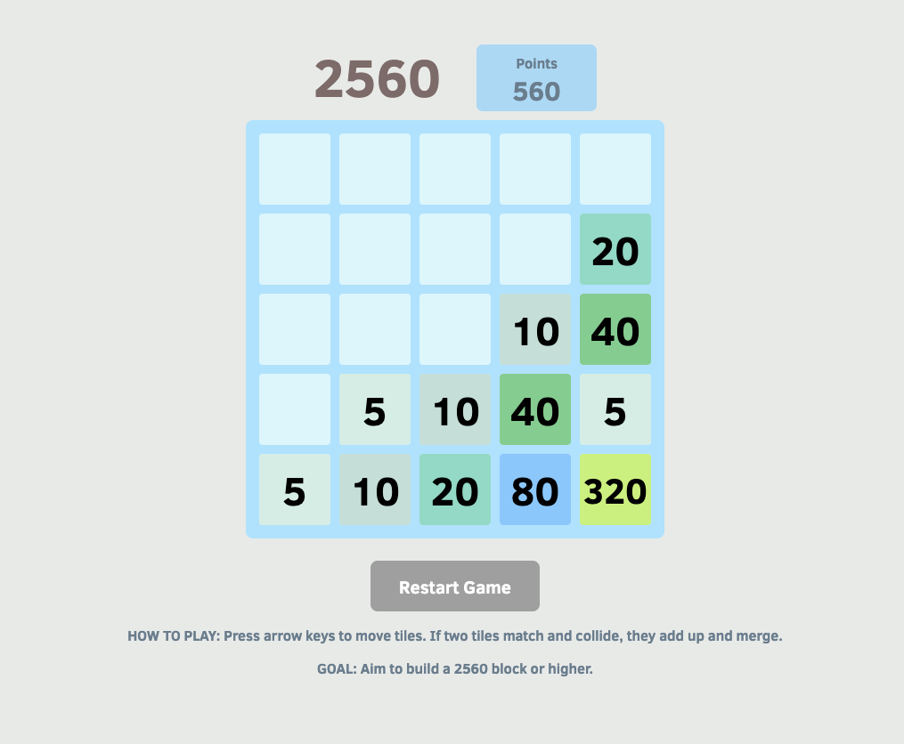

# 2560

## Table of contents
* [General info](#general-info)
* [Screenshots](#screenshots)
* [Technologies](#technologies)
* [Setup](#setup)
* [Features](#features)
* [Status](#status)
* [Inspiration](#inspiration)

## General info
2560 is a 2048-inspired game based on factors of 5. The goal is to try to create a 2560 block.

[Live Link](https://bcwan.github.io/)

## Screenshots


## Technologies
* JavaScript ES6
* Webpack
* HTML/CSS

## Setup
* Do a `git clone` of the file
* Then `cd` into the file. Make sure you are on the root level of 2560 folder.
* Afterwards, open two terminals
  * First, do an `npm install` in one terminal. Wait for that to finish.
  * Then, in the second terminal, do `npm run watch`
* Then in the terminal where you ran `npm install`, run `open index.html`
  * The game should open in your browser

## Code Examples
* One of the moving algorithms that checks how many free spaces there are for the block to move (this function runs if down-key is pressed). All four directions has a specific function similar to below.
```
function lastEmptyPosDown(posClass) {
    let pos = posClass.split("-");
    let row = parseInt(pos[1]);
    let currentCol = parseInt(pos[2]);

    row = row + 1;
    while (row <= this.grid.length - 1) {
      if (this.grid[row][currentCol] === null) {
        row++;
      } else {
        return row - 1;
      }
    }
    return this.grid.length - 1;
}
```

* Here's another moving algorithm that merges blocks together if they are equivalent if down key is pressed. `merging` is a helper function that helps us upgrade block numbers. Every direction has a similar function to below.
```
  mergeBlockDown(posClass) {
    //find the closest block
    let pos = posClass.split("-");
    let row = parseInt(pos[1]);
    let currentCol = parseInt(pos[2]);
    let currentBlock = this.board.grid[row][currentCol];

    let oldCol = currentCol;
    let oldRow = row;
    row = row + 1;
    let nextBlock = null;


    while (row < this.board.grid.length) {
      if (this.board.grid[row][currentCol] === null) {
        row++;
      } else {
        nextBlock = this.board.grid[row][currentCol];
        break;
      }
    }

    this.merging(nextBlock, currentBlock, oldRow, oldCol, row, currentCol);
  }

  merging (nextBlock, currBlock, oldRow, oldCol, currRow, currCol) {
    if (nextBlock !== null && currBlock.number === nextBlock.number) {
      // delete current block
      let currentNextBlockNumber = nextBlock.number;

      currBlock.block.remove();
      this.board.grid[oldRow][oldCol] = null;

      nextBlock.block.remove();
      this.board.grid[currRow][currCol] = null;

      // add new block in place of old one
      let upgradedBlock = new Block([currRow, currCol], currentNextBlockNumber * 2);
      this.board.grid[currRow][currCol] = upgradedBlock;

      let blockContainer = document.getElementById('block-container');
      blockContainer.appendChild(upgradedBlock.block);
    }
  }
```

## Features
List of features
* Sliding blocks on grid based on direction key pressed
* Blocks that do not have equivalent numbers will not merge
* Reset button for new game

To-do list:
* Block numbers font shrinking as block numbers get higher e.g. 2560
* Sound for sliding blocks

## Status
Project is: _in progress_. 

## Inspiration
Project was inspired by 2048. [Here's the link to 2048](https://play2048.co/)